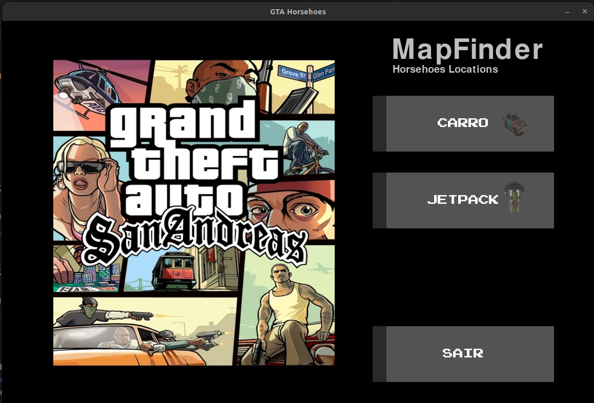
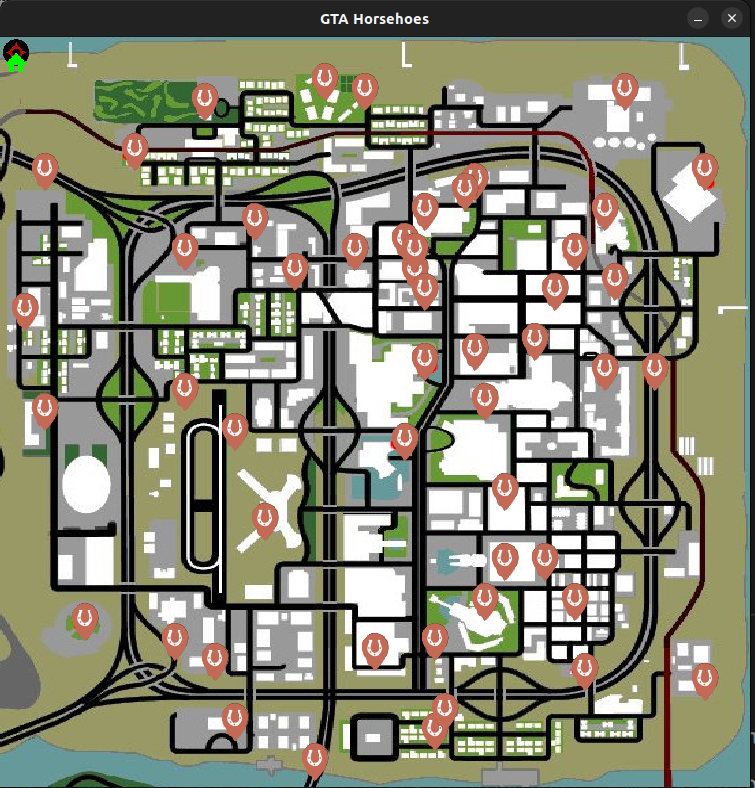
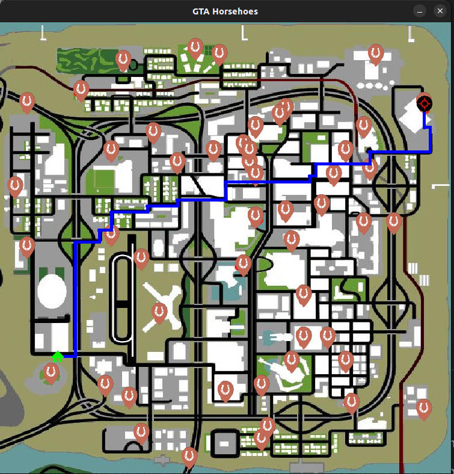

**Grafos2_MapFinder.** 

Temas:
 - Grafos2

# MapFinder

**Trabalho**: Grafos 2<br>
**Conteúdo da Disciplina**: Grafos 2<br>

## Alunos
|Matrícula | Aluno |
| -- | -- |
| 18/0024868  |  Mateus Moreira Lima |
| 19/0044390  |  Victor Rayan Adriano Ferreira  |

## Sobre 
Nosso trabalho utiliza o algoritmo de dijikstra para traçar o menor caminho sobre o mapa da cidade de Las Venturas do jogo Grand Theft Auto San Andreas. Para zerar GTASAN 100% é preciso encontrar todas as ferraduras colecionáveis do jogo. O nosso trabalho tem como objetivo mostrar as localizações das ferraduras e estabelecer um ponto de menor caminho entre a origem(o ponto que você está no mapa) e o destino(uma das 50 ferraduras do jogo).

O mapa utiliza duas formas de traçar os objetivos, uma por carro outra por jetpack. Com o carro ele utiliza as ruas como caminho. Com o jetpack ele traça o caminho com a menor distância, voando sobre a cidade de Las venturas.

## Screenshots

Tela do menu inicial:


Mapa do jogo.



Tela com objetivos traçados utilizando o carro:



Tela com objetivos traçados utilizando jetpack:


## Instalação 
**Linguagem**: Python<br>
**Biblioteca**: Pygame<br>

Para rodar a aplicação é necessário ter instalado em sua máquina o python 3 e o pygame.

### Rode o comando a seguir para baixar o pygame:
```
$ pip install pygame
```
ou
```
$ pip3 install pygame
```

### Para rodar a aplicação certifique de estar dentro da pasta Mapfinder:

Para entrar dentro da pasta Mapfinder

```
$ cd Mapfinder
```

### Rodar a aplicação:
```
$ python controler.py
```
ou
```
$ python3 controler.py
```


## Uso 
1. Selecione o meio de transporte desejado para traçar a rota, Carro ou Jetpack.
2. Utilize o botão esquerdo do mouse para selecionar a sua posição de origem, e o botão direito como destino. 
3. Para retornar ao menu pressione a tecla C.

!! Caso esteja de carro utilize as vias como origem do destino. !!

!! O seu destino deve sempre ser uma ferradura espalhada pelo mapa. !!


